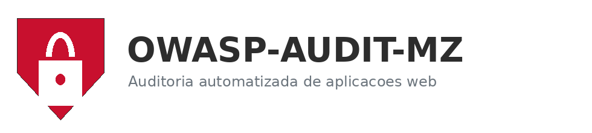

<p align="center">
  
</p>

<p align="center">
  <strong>Plataforma de auditoria automatizada de vulnerabilidades em aplicações web, baseada no padrão OWASP Top 10.</strong><br>
  Aplicação Laravel autónoma, com motor de descoberta e scanners próprios. Sem dependência de scanners externos.
</p>

<p align="center">
  
  
  
  
  
</p>

---

## Visão geral

O **OWASP-AUDIT-MZ** é uma plataforma web que executa, de forma autónoma, auditorias de segurança em aplicações web. Diferentemente das ferramentas comerciais, contém o seu próprio motor de auditoria, composto por um *crawler* HTTP e oito verificadores de vulnerabilidades especializados.

A plataforma foi concebida no contexto académico moçambicano para o Trabalho de Fim de Curso da UnISCED, mas é genérica e replicável em qualquer instituição.

## Capacidades

- Descoberta automática de páginas e endpoints da aplicação alvo (BFS configurável + sondagem de paths conhecidos para SPAs).
- **Motor de scanners próprio**, cobrindo o OWASP Top 10 em modo black-box:
  - `SQLI` (A03 Injection): payloads de erro, boolean-based e time-based
  - `XSS` (A03 Injection): reflexão verbatim de marcador único
  - `CSRF` (A01 Broken Access Control): análise de formulários POST sem token
  - `SECHEAD` (A05 Security Misconfiguration): cabeçalhos CSP, HSTS, X-Frame, etc.
  - `COOKIE` (A05 Security Misconfiguration): flags Secure, HttpOnly, SameSite
  - `DIRLIST` (A05 Security Misconfiguration): directory listing exposto
  - `INFODISC` (A05 Security Misconfiguration): cabeçalhos informativos (Server, X-Powered-By)
  - `AUTH` (A02/A07): password sem HTTPS, autocomplete em campos sensíveis
- Relatório técnico detalhado: evidência, código vulnerável vs correcção recomendada, link OWASP e CWE.
- Triagem por vulnerabilidade: estado (em aberto, aceite, falso positivo, corrigido) e notas internas.
- Comparação entre auditorias do mesmo alvo, com delta por nível de risco.
- Exportação em **PDF** e **CSV**.
- Envio automático do relatório por **e-mail** para destinatários configurados na criação da auditoria.
- Notificações no navegador via Notification API e toasts Bootstrap.
- Painel administrativo `/admin/errors` com monitoria interna de excepções.

## Stack

| Camada | Tecnologia |
|---|---|
| Backend | PHP 8.2+, Laravel 10 |
| HTTP / DOM | Guzzle 7, Symfony DomCrawler 6 |
| Base de dados | MySQL 8 |
| Frontend | Blade, Bootstrap 5, JavaScript ES6 |
| PDF | barryvdh/laravel-dompdf |
| Alvo de teste | OWASP Juice Shop (Docker) |

## Requisitos

- Windows 10/11, macOS ou Linux
- PHP 8.2 ou superior, com extensões `pdo_mysql`, `mbstring`, `openssl`, `tokenizer`, `xml`, `json`, `curl`, `fileinfo`
- Composer 2.x
- MySQL 8 (WAMP, XAMPP, MAMP ou instalação directa)
- Docker Desktop (apenas para correr o alvo OWASP Juice Shop)

## Instalação local

```bash
git clone https://github.com/<utilizador>/owasp-audit-mz.git
cd owasp-audit-mz
composer install
cp .env.example .env
php artisan key:generate
```

Criar a base de dados em MySQL e editar `.env` com as credenciais:

```env
DB_DATABASE=owasp_audit_mz
DB_USERNAME=root
DB_PASSWORD=
```

Aplicar migrações e seeders:

```bash
php artisan migrate --seed
```

Contas criadas pelo seeder:

| E-mail | Palavra-passe | Papel |
|---|---|---|
| `admin@audit-mz.local` | `admin12345` | Administrador |
| `auditor@audit-mz.local` | `auditor12345` | Auditor |

Arrancar o alvo de testes (em separado):

```bash
docker pull bkimminich/juice-shop
docker run --name juice-shop -d -p 3000:3000 bkimminich/juice-shop
```

Servir a plataforma:

```bash
php artisan serve
```

Aceder em `http://127.0.0.1:8000`.

## Configuração de e-mail

Para envio real de relatórios, configurar SMTP no `.env`:

```env
MAIL_MAILER=smtp
MAIL_HOST=smtp.gmail.com
MAIL_PORT=587
MAIL_USERNAME=conta@gmail.com
MAIL_PASSWORD=app_password
MAIL_ENCRYPTION=tls
MAIL_FROM_ADDRESS="no-reply@audit-mz.local"
MAIL_FROM_NAME="OWASP-AUDIT-MZ"
```

Em ambiente de desenvolvimento, manter `MAIL_MAILER=log` envia os e-mails para `storage/logs/laravel.log` sem necessidade de SMTP.

## Variáveis do motor de auditoria

```env
AUDIT_CRAWLER_MAX_DEPTH=3
AUDIT_CRAWLER_MAX_PAGES=200
AUDIT_HTTP_TIMEOUT=15
AUDIT_USER_AGENT="OWASP-AUDIT-MZ/1.0"
INTERNAL_MONITORING_ENABLED=true
INTERNAL_MONITORING_LEVEL=error
```

## Utilização

1. Iniciar sessão em `/login`.
2. **Nova auditoria**: introduzir URL alvo, opcionalmente lista de destinatários (separados por vírgula) que recebem o relatório PDF por e-mail.
3. Confirmar autorização e submeter.
4. Após conclusão, abrir **Ver relatório** para inspecção detalhada por categoria OWASP Top 10.
5. Marcar cada vulnerabilidade como aceite, falso positivo ou corrigida.
6. Exportar em PDF, CSV ou reenviar por e-mail.
7. Comparar com auditoria anterior do mesmo alvo (botão "Comparar com #X").

## Estrutura

```text
app/
  Checks/                  oito vulnerability checks + interface
  Http/Controllers/        web e API
  Http/Middleware/         auth, admin, csrf
  Models/                  Eloquent
  Services/                Crawler, Scanner, Report, Notification, ErrorMonitoring
  Mail/                    AuditReportMail
  Policies/                AuditPolicy
config/                    audit.php, mail.php
database/migrations/       6 ficheiros, 10 tabelas
resources/views/           Blade
public/                    index.php, css, js, img
routes/                    web.php, api.php
.github/workflows/ci.yml   pipeline de integração contínua
```

## Documentação académica

Os três documentos da monografia que sustentam o projecto estão disponíveis no repositório pai (`../`):

- Documento I — Análise e Especificação de Requisitos
- Documento II — Modelagem do Sistema (UML, PlantUML)
- Documento III — Implementação e Testes

## Contribuir

Leia [CONTRIBUTING.md](CONTRIBUTING.md) para o fluxo Git, política de branches, padrões de código e processo de Pull Request.

## Licença

Distribuído sob a licença MIT. Ver [LICENSE](LICENSE).

## Uso ético

Esta plataforma destina-se a ambientes laboratoriais autorizados. A interface obriga o utilizador a confirmar autorização antes de cada auditoria. O uso em sistemas em produção sem consentimento expresso do proprietário é proibido pelo artigo 23.º da Lei n.º 3/2017 de Moçambique e contraria as boas práticas internacionais da OWASP.

---

<p align="center">
  Desenvolvido por <strong>Augusto Domingos Luís</strong><br>
  Trabalho de Fim de Curso · Engenharia Informática · UnISCED · Centro de Recursos de Quelimane · 2026
</p>

